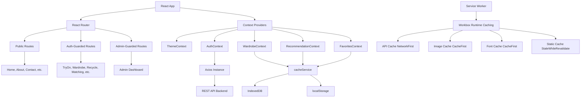
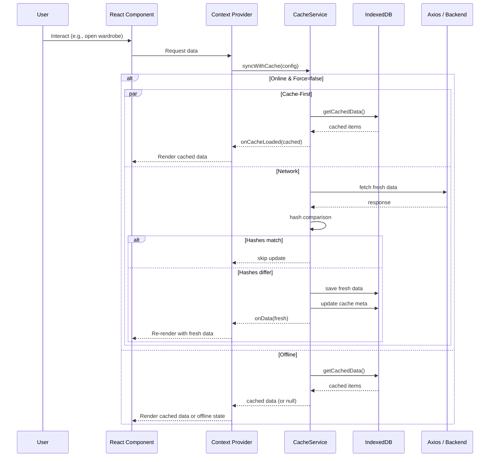
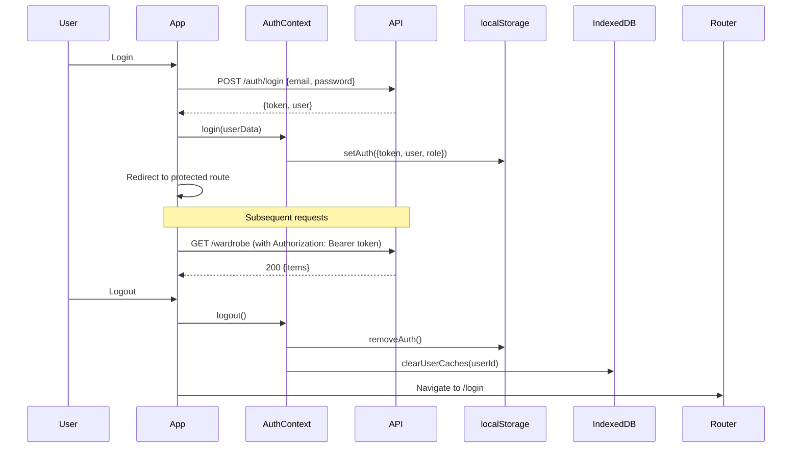

<p align="center">
  
</p>

<h1 align="center">ReDolapy — Virtual Try-On & Fashion Recycling Platform</h1>

<p align="center">
  <strong>AI-Powered Fashion Intelligence Platform</strong>
</p>

<p align="center">
  <a href="#features">Features</a> •
  <a href="#tech-stack">Tech Stack</a> •
  <a href="#project-structure">Structure</a> •
  <a href="#installation">Installation</a> •
  <a href="#api-integration">API</a> •
  <a href="#pwa-features">PWA</a> •
  <a href="#deployment">Deployment</a>
</p>

---

## Overview

ReDolapy is a full-featured fashion technology platform that combines AI-powered outfit recommendations, virtual try-on technology, wardrobe management, clothing recycling/upcycling, and product matching into a single Progressive Web App (PWA). The platform uses computer vision and generative AI to provide personalized fashion experiences.

### Purpose

To revolutionize the fashion shopping experience by reducing return rates, promoting sustainable fashion through recycling and upcycling, and providing AI-powered styling recommendations tailored to individual preferences and weather conditions.

### Key User Workflows

1. **Upload wardrobe** → Get AI recommendations → Virtual try-on → Save favorites
2. **Browse stores** → View products → Virtual try-on with product → Purchase
3. **Select clothing items** → AI analyzes for recycling → Pick design idea → Generate upcycled design
4. **Choose wardrobe item** → AI finds matching products from stores → Try matched outfits
5. **Create avatar** → Use avatar for virtual try-on → Generate personalized outfits
6. **Manage wardrobe** → Add items via analysis → Edit details → Organize by category

---

## Features

### Authentication

- **Email/Password Registration & Login** — Standard auth flow with email validation
- **Google OAuth** — Social login via popup window and callback redirect
- **Password Reset** — Forgot password flow with OTP verification via email
- **Session Management** — JWT tokens stored in `localStorage` with automatic Bearer token injection via Axios interceptor
- **Protected Routes** — `AuthGuard` ensures authenticated access; `UserGuard` redirects admins to `/admin`; `AdminGuard` restricts admin routes to `admin` role only

### User Profile

- **Edit Profile** — Update first/last name, email, gender, and preferences
- **Profile Image** — Upload and manage user profile photo
- **User Avatar** — View and manage AI-generated avatars
- **Settings** — Language preference (stored on server via API) and notification toggles
- **Account Deletion** — Full account removal with confirmation dialog
- **Subscription Status** — View current plan (Essential/Pro) and manage payments
- **Offline Caching** — Profile data cached in IndexedDB for offline access

### Dashboard / Home Page

- **Hero Section** — Landing hero with CTA to start styling
- **Intro Section** — Three-step onboarding (Upload & Sync → Neural Analysis → Curated Styling)
- **Features Section** — AI Recommendations, Virtual Try-On, Recycle/Upcycle
- **Sustainability Section** — Circular fashion education and lifecycle management
- **Virtual Mirror Section** — Promotes the virtual try-on experience
- **Pricing Section** — Subscription plan overview (Essential free tier, Pro paid tier)
- **FAQ Section** — Common questions about the platform

### Wardrobe Management

- **Digital Wardrobe** — Manage all uploaded clothing items in one place
- **Add Items** — Upload clothing images directly or add via image analysis
- **Categorization** — Items organized by category (top, bottom, dress, etc.) with dynamic filter options
- **Edit & Delete** — Update item details or remove from wardrobe
- **Health Indicator** — Visual indicator showing wardrobe item count
- **Pagination** — Items displayed in paginated grid (20 per page) with "Show More"
- **Offline Access** — Wardrobe data cached in IndexedDB with hash-based sync
- **Context Provider** — `WardrobeContext` provides centralized state with cache-first loading strategy

### Virtual Try-On

- **Model Selection** — Choose between AI-generated **Avatar** or uploaded **Personal Photo**
- **Wardrobe Integration** — Select up to 2 items from your digital wardrobe (with category conflict detection)
- **Gallery Upload** — Upload custom clothing images with category assignment (top/bottom/dress)
- **Store Product Try-On** — Navigate from store product directly to try-on with product pre-loaded
- **Single Item Try-On** — Try one garment on your model
- **Outfit Try-On** — Combine top + bottom for complete outfit visualization
- **AI Generation** — Powered by KIE API with configurable API key
- **Save Results** — Save generated try-on images to your account history
- **Result Preview** — Full-screen preview with scroll-into-view behavior
- **Avatar Auto-Load** — Automatically uses your latest created avatar

### Matching Feature

- **Wardrobe-to-Store Matching** — Select a wardrobe item and find visually similar products from connected stores
- **Image Analysis** — Upload clothing photo for AI-powered visual analysis (color, pattern, category, style)
- **Analysis-Based Matching** — Get product matches based on analysis results
- **Geolocation** — Optional lat/lon coordinates for location-aware results
- **Product Caching** — Product matches cached in IndexedDB with batch retrieval
- **Favorites Integration** — Add matched products directly to favorites

### Recycling / Upcycling

- **Multi-Item Selection** — Select up to 2 items from wardrobe or upload new images
- **AI Analysis** — Uploaded items analyzed by AI for material, condition, and reuse potential
- **Design Ideas** — AI generates multiple design/upcycling ideas based on the analyzed items
- **Idea Generation** — Generate visual designs from selected ideas using configurable AI models
- **Model Selection** — Choose AI model for generation (e.g., `qwen-image-2.0-pro`)
- **Aspect Ratio Control** — Configure output aspect ratio for generated designs
- **Step-by-Step Workflow** — Select Items → Get Ideas → Generate Design
- **Session Management** — Recycle sessions tracked via server-side session IDs

### Recommendation System

- **Daily AI Outfits** — Personalized outfit recommendation generated daily based on weather and wardrobe items
- **Weather Integration** — Recommendations include temperature, condition, humidity, and wind speed data
- **Weekly Calendar** — View past recommendations organized in a weekly grid (Saturday–Friday)
- **Outfit Details** — Click any day to view outfit items, names, and styles
- **Time-of-Day Greeting** — Dynamic greeting (morning/afternoon/evening) based on user's local time
- **Arabic Translation** — Outfit names and styles automatically translated via MyMemory API
- **Server Cache** — 5-minute cooldown on daily fetch to prevent duplicate requests
- **History Tracking** — Full recommendation history with date-based deduplication
- **Offline Support** — Recommendations cached in IndexedDB and `localStorage`

### Notifications

- **Real-Time Notification List** — Fetch and display user notifications
- **Read/Unread State** — Mark individual notifications as read
- **Bulk Actions** — Mark all as read, clear all notifications
- **Expand/Collapse** — Expand notification details inline
- **Delete** — Remove individual notifications
- **Unread Count Badge** — Displayed in the navbar bell icon
- **Admin Notifications** — Admin dashboard has broadcast notification capabilities
- **Scheduled Notifications** — Admin can create and manage scheduled notifications
- **Automated Notifications** — Configurable automated notification rules (admin)

### Store Browsing

- **Product Catalog** — Browse products from connected stores
- **Filtering** — Filter by category, store, price range, and color
- **Search** — Search products by name or description
- **Sorting** — Sort by price, name, popularity
- **Grid/List View** — Toggle between grid and list layout
- **Virtual Try-On from Store** — Click "Try-On" on any product to navigate to the try-on page with the product pre-loaded
- **Product Match Indicator** — Visual badge showing whether a product has wardrobe matches
- **Cache-First Loading** — Products loaded from IndexedDB first, then refreshed from API
- **Arabic Translation** — Product names and descriptions translated via MyMemory API

### Avatar Generation

- **Customizable Avatars** — Generate AI avatars with customizable:
  - **Skin Tone** — 6 options from very-light to dark
  - **Hair Color** — 6 options from black to red
  - **Gender** — Male or Female
- **Avatar Management** — View and select previously generated avatars
- **Image Retrieval** — Fetch avatar images by ID as blob for use in try-on
- **Auto-Integration** — Latest avatar automatically used in virtual try-on

### Subscription & Payments

- **Tiered Pricing** — Essential (free) and Pro ($19.99/month) subscription plans
- **Payment Integration** — Stripe/Checkout session creation via backend
- **Subscription Management** — Cancel or sync subscription status
- **Caching** — Subscription status cached in IndexedDB (5-minute TTL)
- **Plan Features** — Pro includes unlimited uploads, high-fidelity images, and advanced features

### About Pages

- **About Try-On** — Detailed information about the virtual try-on technology
- **About Recycle** — Detailed information about the recycling/upcycling process
- **About Company** — Company overview, sustainability commitment, and team section
- **Contact Us** — Contact form for user inquiries and support

### Offline Support

- **Offline Page** — Styled offline fallback page with retry and home navigation buttons
- **Cached Routes** — Home (`/`), About (`/about`), About Recycle (`/about-recycle`), About Try-On (`/about-tryon`), Contact Us (`/contact-us`) are accessible offline
- **Graceful Degradation** — Authenticated routes return cached data from IndexedDB when offline

### Admin Dashboard

- **Dashboard Overview** — Stats for stores, products, users, and notifications
- **Store Management** — CRUD operations for connected stores
- **Product Management** — CRUD for products with bulk operations
- **User Management** — View, create, update, delete users; role management (User/Premium/Admin)
- **Notification Center** — View, send broadcast notifications, send to specific users
- **Email Center** — View email threads, reply, compose new emails to users
- **API Key Management** — View and manage API keys
- **Contact Messages** — View and manage contact form submissions
- **Scheduled Notifications** — View and cancel scheduled notifications
- **Automated Notifications** — Configure automated notification rules

### Additional Modules

- **Favorites** — Save wardrobe items, products, try-on results, and recycle designs with optimistic UI updates
- **PWA Install Prompt** — Custom install button using `beforeinstallprompt` event
- **PWA Update Prompt** — Notify users when a new version is available with update/dismiss options
- **Google OAuth Callback** — Handles OAuth redirect and token extraction from URL
- **Custom 404 Page** — Styled not-found page with navigation back to home
- **Loading Screen** — Animated loading overlay using Lottie animations
- **Empty State** — Context-aware empty state messages with action buttons
- **Confirmation Dialogs** — SweetAlert2-powered confirmations for destructive actions

---

## Tech Stack

### Core

| Technology | Version | Purpose |
|---|---|---|
| **React** | ^19.2.6 | UI framework |
| **Vite** | ^8.0.12 | Build tool and dev server |
| **React Router** | ^7.17.0 | Client-side routing |
| **JavaScript (JSX)** | ES2024 | Application language |

### State Management

| Technology | Purpose |
|---|---|
| **React Context API** | Global state management (Auth, Theme, Wardrobe, Recommendations, Favorites) |
| **Custom Hooks** | `useOnlineStatus`, `useCacheSync` |

### UI & Styling

| Technology | Purpose |
|---|---|
| **Tailwind CSS** | ^4.3.0 — Utility-first CSS framework |
| **Material UI (MUI)** | ^9.0.1 — Component library (icons, progress, styled) |
| **CSS Custom Properties** | Theming via CSS variables (light/dark/admin themes) |
| **CSS Modules** | Scoped styles (`style.module.css`) |
| **lucide-react** | ^1.17.0 — Icon library |
| **Custom SVG Icons** | 28 custom icon components in `src/icons/` |
| **lottie-web** | ^5.13.0 — Lottie animation player |
| **@fontsource** | Roboto, Plus Jakarta Sans, Geist fonts |

### API & Data

| Technology | Purpose |
|---|---|
| **Axios** | ^1.17.0 — HTTP client with interceptor |
| **IndexedDB** | Browser storage for offline caching |
| **localStorage** | Auth tokens, theme, language, daily outfit cache |

### PWA

| Technology | Purpose |
|---|---|
| **vite-plugin-pwa** | ^1.3.0 — PWA integration with Workbox |
| **Workbox** | Service worker runtime caching strategies |
| **Web App Manifest** | Installable PWA configuration |

### Internationalization

| Technology | Purpose |
|---|---|
| **i18next** | ^26.3.1 — Internationalization framework |
| **react-i18next** | ^17.0.8 — React bindings |
| **i18next-browser-languagedetector** | ^8.2.1 — Auto-detect browser language |
| **MyMemory API** | Runtime English-to-Arabic translation |

### Other Dependencies

| Technology | Purpose |
|---|---|
| **sweetalert2** | ^11.26.25 — Toast notifications and dialogs |
| **sharp** | ^0.35.1 — Image processing |
| **styled-components** | ^6.4.2 — CSS-in-JS (MUI support) |
| **@emotion/react/styled** | MUI styling engine |
| **@tailwindcss/vite** | Tailwind CSS Vite plugin |

### Dev Tools

| Technology | Purpose |
|---|---|
| **ESLint** | ^10.3.0 — Linting with React Hooks and Refresh plugins |
| **@vitejs/plugin-react** | ^6.0.1 — Vite React plugin |

---

## Project Structure

```
redolapy/
├── public/                          # Static assets (served as-is)
│   ├── favicon.png / .svg           # App favicons
│   ├── logo-dark.svg / logo-light.svg
│   ├── pwa-192x192-v2.png           # PWA icon (192x192)
│   ├── pwa-512x512-v2.png           # PWA icon (512x512)
│   ├── boyTryOn.png                 # Try-On avatar preview
│   ├── cameraFrame.png              # Upload camera placeholder
│   ├── google.svg                   # Google OAuth button icon
│   ├── login.jpg / login2.jpg       # Auth page backgrounds
│   ├── *.json                       # Lottie animation files
│   └── *.png / *.svg                # Other images
│
├── src/
│   ├── main.jsx                     # App entry point
│   ├── App.jsx                      # Root component, router, providers
│   ├── index.css                    # Global styles, Tailwind, themes, CSS variables
│   ├── App.css                      # (empty)
│   │
│   ├── api/                         # API service layer
│   │   ├── axiosInstance.js         # Axios instance with Bearer token interceptor
│   │   ├── authApi.js               # Endpoints: /auth/*
│   │   ├── userApi.js               # Endpoints: /users/*, /products, /stores, /wardrobe, /analyze
│   │   ├── tryOnApi.js              # Endpoints: /virtual-tryon, /virtual-tryon/outfit
│   │   ├── wardrobeApi.js           # Endpoint: /wardrobe
│   │   ├── wardrobeService.js       # Wardrobe item fetch by ID
│   │   ├── recommendationsApi.js    # Endpoints: /recommendations (GET + POST)
│   │   ├── recycleApi.js            # Endpoints: /recycle/*
│   │   ├── matchingApi.js           # Endpoints: /matches, /analyze, /matches/analysis
│   │   ├── avatarApi.js             # Endpoints: /avatars/*
│   │   ├── paymentApi.js            # Endpoints: /payments/*
│   │   ├── notificationApi.js       # Endpoints: /notifications/*
│   │   ├── adminApi.js              # Endpoints: admin CRUD for stores, products, users, etc.
│   │   └── favorites_services/
│   │       └── favoritesService.js  # Favorites CRUD with enrichment
│   │
│   ├── context/                     # React Context providers
│   │   ├── AuthContext.jsx          # User auth state, login/logout
│   │   ├── ThemeContext.jsx         # Dark/light theme with system preference detection
│   │   ├── WardrobeContext.jsx      # Wardrobe items with cache-first loading
│   │   ├── RecommendationContext.jsx # Daily recommendations, weather, history
│   │   └── FavoritesContext.jsx     # Favorites with optimistic updates
│   │
│   ├── hooks/                       # Custom React hooks
│   │   ├── useOnlineStatus.js       # Online/offline detection
│   │   └── useCacheSync.js          # Cache synchronization utility
│   │
│   ├── services/                    # Client-side data services
│   │   ├── indexedDB.js             # IndexedDB wrapper — 10 object stores
│   │   └── cacheService.js          # Cache sync with hash-based invalidation
│   │
│   ├── utils/                       # Utility functions
│   │   ├── tokenUtils.js            # localStorage auth get/set/remove
│   │   ├── proxiedFetch.js          # KIE image proxy URL helper
│   │   ├── dailyRecommendation.js   # Daily outfit caching and localStorage helpers
│   │   ├── translate.js             # MyMemory API English→Arabic translation
│   │   └── toast.js                 # SweetAlert2 toast configuration
│   │
│   ├── i18n/                        # Internationalization
│   │   ├── i18n.js                  # i18next configuration
│   │   ├── locales/
│   │   │   ├── en.json              # English translations (~800 keys)
│   │   │   └── ar.json              # Arabic translations (~800 keys)
│   │   └── admin/
│   │       ├── adminI18n.js         # Admin-specific i18next instance
│   │       └── locales/
│   │           ├── en.json          # Admin English translations (~300 keys)
│   │           └── ar.json          # Admin Arabic translations (~300 keys)
│   │
│   ├── components/                  # Shared/reusable components
│   │   ├── Navbar.jsx               # Responsive nav with auth, theme toggle, i18n, notifications
│   │   ├── Footer.jsx               # Site footer
│   │   ├── Button.jsx               # Reusable button component
│   │   ├── AuthModal.jsx            # Authentication dialog/modal
│   │   ├── LoadingScreen.jsx        # Full-screen Lottie loading overlay
│   │   ├── EmptyState.jsx           # Empty state with optional action button
│   │   ├── PWAUpdatePrompt.jsx      # "New version available" update prompt
│   │   ├── PwaInstallButton.jsx     # "Install App" button (beforeinstallprompt)
│   │   ├── NotificationWindow.jsx   # Notification dropdown list
│   │   ├── OutfitDetailModal.jsx    # Weekly outfit detail modal
│   │   ├── SlidingOverlay.jsx       # Animated sliding panel
│   │   ├── wardrobe/                # Wardrobe sub-components
│   │   │   ├── WardrobeHealth.jsx
│   │   │   ├── WardrobeFilters.jsx
│   │   │   ├── WardrobeItemCard.jsx
│   │   │   ├── EmptyState.jsx
│   │   │   ├── AddItemModal.jsx
│   │   │   ├── ItemDetailsModal.jsx
│   │   │   └── EditItemWardrobe.jsx
│   │   ├── store/                   # Store sub-components
│   │   │   ├── FilterSidebar.jsx
│   │   │   └── ProductCard.jsx
│   │   └── tryOn/                   # Try-On sub-components
│   │       ├── ModelSelectionCard.jsx
│   │       └── WardrobeItem.jsx
│   │
│   ├── pages/                       # Page-level components
│   │   ├── Layout.jsx               # Main app layout (navbar, footer, auth modal, offline check)
│   │   ├── AdminLayout.jsx          # Admin layout wrapper
│   │   ├── home/
│   │   │   ├── Home.jsx             # Landing page (composes all sections)
│   │   │   └── components/
│   │   │       ├── Hero.jsx
│   │   │       ├── Intro.jsx
│   │   │       ├── Features.jsx
│   │   │       ├── Sustainability.jsx
│   │   │       ├── Mirror.jsx
│   │   │       ├── Pricing.jsx
│   │   │       └── Questions.jsx
│   │   ├── Auth/
│   │   │   ├── AuthPage.jsx         # Auth orchestrator (login/register/forgot/reset)
│   │   │   ├── Login.jsx
│   │   │   ├── Register.jsx
│   │   │   ├── ForgotPassword.jsx
│   │   │   ├── OtpVerification.jsx
│   │   │   ├── ResetPassword.jsx
│   │   │   └── GoogleCallback.jsx
│   │   ├── tryOn/
│   │   │   ├── TryOn.jsx            # Virtual Try-On page (~1038 lines)
│   │   │   └── style.module.css
│   │   ├── wardrobe/
│   │   │   └── WardrobePage.jsx
│   │   ├── recycle/
│   │   │   ├── Recycle.jsx          # AI Recycling page (~561 lines)
│   │   │   └── components/
│   │   │       ├── StepIndicator.jsx
│   │   │       ├── UploadArea.jsx
│   │   │       ├── UploadedImageCard.jsx
│   │   │       ├── DesignIdeaCard.jsx
│   │   │       ├── SettingsRow.jsx
│   │   │       └── GeneratedDesign.jsx
│   │   ├── matching/
│   │   │   └── Matching.jsx         # Outfit matching page (~821 lines)
│   │   ├── store/
│   │   │   └── StoresPage.jsx       # Store browsing page (~472 lines)
│   │   ├── recommendations/
│   │   │   └── RecommendationsPage.jsx  # AI recommendations page (~309 lines)
│   │   ├── avatar/
│   │   │   └── AvatarGeneration.jsx # Avatar creator (~512 lines)
│   │   ├── profile/
│   │   │   ├── EditProfilePage.jsx  # User profile edit (~530 lines)
│   │   │   └── ProfilePopup.jsx     # Profile dropdown popup
│   │   ├── fav/
│   │   │   └── Fav.jsx              # Favorites page
│   │   ├── pricing/
│   │   │   └── PricingPage.jsx      # Subscription plans & checkout (~666 lines)
│   │   ├── about/
│   │   │   ├── About.jsx
│   │   │   └── components/
│   │   │       ├── HeroSection.jsx
│   │   │       └── TeamSection.jsx
│   │   ├── aboutRecycle/
│   │   │   └── AboutRecycle.jsx
│   │   ├── aboutTryOn/
│   │   │   └── AboutTryon.jsx
│   │   ├── contactUs/
│   │   │   └── ContactUs.jsx
│   │   ├── admin/
│   │   │   ├── AdminDashboardPage.jsx  # Admin dashboard orchestration (~300 lines)
│   │   │   ├── AdminLayout.jsx
│   │   │   └── sections/            # Admin section components
│   │   │       ├── DashboardSection.jsx
│   │   │       ├── StoresSection.jsx / AddStoreSection.jsx
│   │   │       ├── ProductsSection.jsx / AddProductSection.jsx
│   │   │       ├── NotificationsSection.jsx / AddNotificationSection.jsx
│   │   │       ├── EmailCenterSection.jsx
│   │   │       ├── UsersSection.jsx / AddUserSection.jsx
│   │   │       ├── ApiManagementSection.jsx
│   │   │       ├── SettingsSection.jsx
│   │   │       ├── AutomatedNotificationsSection.jsx
│   │   │       └── ScheduledNotificationsSection.jsx
│   │   ├── OfflinePage/
│   │   │   └── OfflinePage.jsx      # Offline fallback page
│   │   └── NotFound/
│   │       └── NotFound.jsx         # 404 page
│   │
│   └── icons/                       # 28 custom SVG icon components
│       ├── AddIcon.jsx
│       ├── ArrowRightIcon.jsx
│       ├── BodyIcon.jsx
│       ├── CameraIcon.jsx
│       ├── RecycleIcon.jsx
│       ├── ShuffleIcon.jsx
│       └── ... (28 total)
│
├── index.html                       # HTML entry point with PWA meta tags
├── vite.config.js                   # Vite config with PWA, Tailwind, proxy
├── eslint.config.js                 # ESLint flat config
├── package.json
├── Dockerfile                       # Multi-stage Docker build (Node → Nginx)
├── vercel.json                      # SPA rewrites for Vercel deployment
├── .env                             # Environment variables template
├── .env.development                 # Development environment variables
├── .env.production                  # Production environment variables
└── .gitignore
```

---

## Architecture

### Application Architecture



### Data Flow



### State Management

The application uses **React Context API** with five context providers wrapped at the root level:

1. **ThemeContext** — Manages light/dark theme with system preference detection and localStorage persistence. Applies `.dark` class to `<html>` element.
2. **AuthContext** — Manages user authentication state, login/logout functions. Syncs with `localStorage` via `tokenUtils`.
3. **WardrobeContext** — Manages wardrobe items with cache-first loading strategy. Uses `syncWardrobeCache` for offline-first data retrieval.
4. **RecommendationContext** — Manages daily outfit recommendations, weather data, and history. Handles translation, cooldown, and offline fallback.
5. **FavoritesContext** — Manages favorites with optimistic UI updates, enrichment from multiple data sources, and pending request deduplication.

### API Communication

- **Axios Instance** (`src/api/axiosInstance.js`) — Configured with dynamic `baseURL` from `VITE_API_URL` env variable. A request interceptor automatically injects the JWT Bearer token from `localStorage`.
- **API Modules** — Each backend domain has a dedicated API module under `src/api/` exporting named functions that return Axios promise objects.
- **Image Proxying** — KIE image URLs are proxied through the Vite dev server (`/kie-image` → `https://tempfile.aiquickdraw.com`) to avoid CORS issues.
- **Error Handling** — API errors are caught at the component level and displayed via SweetAlert2 toast notifications.

### Caching Strategy

The application implements a **two-tier caching strategy**:

**Tier 1: IndexedDB (Persistent Data Cache)**

| Object Store | Key | Purpose |
|---|---|---|
| `wardrobe` | `_id` (indexed by `userId`) | User's wardrobe items |
| `products` | `_id` | Product catalog |
| `stores` | `_id` | Store list |
| `recommendations` | `_id` (indexed by `userId`) | Recommendation history |
| `favorites` | `_id` (indexed by `userId`) | Favorite items |
| `user_profile` | `userId` | User profile data |
| `subscription` | `userId` | Subscription status |
| `product_matches` | `productId` | Product match results |
| `cache_meta` | `key` (e.g., `userId:wardrobe`) | Cache timestamps and hashes |

**Tier 2: localStorage (Lightweight Cache)**

| Key | Purpose |
|---|---|
| `auth` | JWT token and user data |
| `theme` | Theme preference |
| `daily_outfit_date_{userId}` | Date of cached daily outfit |
| `daily_outfit_data_{userId}` | Cached daily outfit data |

**Synchronization Logic**: `cacheService.js` implements hash-based cache invalidation. Before fetching from the network, it computes a hash of the current cached data. After fetching, it compares hashes. Only when hashes differ does it update the cache and notify the UI, minimizing unnecessary re-renders.

### Offline Support

- **Service Worker** — Pre-caches all static assets (`js`, `css`, `html`, images, fonts)
- **Runtime Caching** — API calls use `NetworkFirst` with a 10-second timeout and background sync queue
- **Navigation Fallback** — All navigation falls back to `index.html` for SPA routing
- **Cached Routes** — `Layout.jsx` defines `CACHED_PATHS = ["/", "/about", "/about-recycle", "/about-tryon", "/contact-us"]` that render normally even offline
- **Data Offline** — IndexedDB provides previously fetched data for wardrobe, recommendations, favorites, products, and stores
- **Online Status Detection** — `useOnlineStatus` hook listens for `online`/`offline` events; `AuthGuard` bypasses auth redirect when offline

---

## Installation

### Prerequisites

- **Node.js** >= 20.x (uses `node:20-alpine` in Docker)
- **npm** >= 9.x

### Clone Repository

```bash
git clone https://github.com/your-org/redolapy.git
cd redolapy
```

### Install Dependencies

```bash
npm install
```

### Environment Variables

Create `.env` files in the project root (example values provided):

```bash
# .env (development defaults)
VITE_API_URL=http://localhost:5000/api

# .env.development
VITE_API_URL=http://localhost:5000/api

# .env.production
VITE_API_URL=https://your-backend-url/api
```

See the [Environment Variables](#environment-variables) section for all options.

### Run Development Server

```bash
npm run dev
```

The app starts at `http://localhost:5173` by default with HMR enabled.

### Build Production Version

```bash
npm run build
```

Outputs to the `dist/` directory.

### Preview Production Build

```bash
npm run preview
```

### Lint

```bash
npm run lint
```

---

## Environment Variables

| Variable | Required | Purpose | Example Value |
|---|---|---|---|
| `VITE_API_URL` | Yes | Base URL for the REST API backend | `http://localhost:5000/api` |
| `VITE_KIE_API_KEY` | No | API key for KIE virtual try-on service | `kie_live_abc123...` |
| `HF_TOKEN` | Found in `.env` | HuggingFace token (referenced but not consumed in source code) | `hf_...` |

---

## API Integration

### Backend Communication

The application communicates with a REST API backend via Axios. The base URL is configured through the `VITE_API_URL` environment variable. All API functions are organized by domain in `src/api/`.

### Main Endpoints

| Endpoint | Methods | Purpose |
|---|---|---|
| `/auth/check-email/:email` | GET | Check email availability |
| `/auth/login` | POST | User login |
| `/auth/signup` | POST | User registration |
| `/auth/forgot-password` | POST | Request password reset |
| `/auth/verify-otp` | POST | Verify OTP code |
| `/auth/reset-password` | PUT | Reset password |
| `/auth/logout` | POST | Logout |
| `/auth/google` | GET (redirect) | Google OAuth login |
| `/users/profile` | PUT | Update user profile |
| `/users/settings/language` | PUT | Update language preference |
| `/users/settings/notifications` | PUT | Update notification preference |
| `/users/favorites` | GET/POST | List/add favorites |
| `/users/favorites/:id` | DELETE | Remove favorite |
| `/users/user-image` | PUT/DELETE | Manage user profile image |
| `/users/latest-tryon` | POST | Save try-on result |
| `/users/latest-recycle` | GET | Get latest recycle sessions |
| `/users/account` | DELETE | Delete user account |
| `/wardrobe` | GET | List wardrobe items |
| `/wardrobe/:id` | GET/PUT/DELETE | Manage wardrobe item |
| `/wardrobe/from-analysis` | POST | Add item from analysis |
| `/virtual-tryon` | POST | Single garment try-on |
| `/virtual-tryon/outfit` | POST | Multi-item outfit try-on |
| `/recommendations` | GET/POST | Get/request recommendations |
| `/recycle/analyze` | POST | Analyze items for recycling |
| `/recycle/:sessionId/generate/:ideaId` | POST | Generate design from idea |
| `/recycle/:sessionId/generate-all` | POST | Generate all designs |
| `/recycle/:sessionId` | GET | Get session details |
| `/matches` | POST | Get wardrobe item matches |
| `/matches/analysis/:id` | POST | Get matches from analysis |
| `/matches/product/:id` | POST | Get product matches |
| `/analyze` | POST | Analyze clothing image |
| `/analyze/:id` | GET/PUT | Get/update analysis |
| `/products` | GET | List all products |
| `/products/:id` | GET | Get product details |
| `/stores` | GET | List all stores |
| `/payments/create-checkout-session` | POST | Create Stripe checkout |
| `/payments/cancel-subscription` | POST | Cancel subscription |
| `/payments/sync-subscription` | POST | Sync subscription status |
| `/notifications` | GET/DELETE | List/clear notifications |
| `/notifications/:id/read` | PATCH | Mark notification as read |
| `/notifications/read-all` | PATCH | Mark all as read |
| `/notifications/:id` | DELETE | Delete notification |
| `/contact` | POST | Submit contact form |
| `/avatars` | GET/POST | List/create avatars |
| `/avatars/:id` | GET | Get avatar details |
| `/avatars/:id/image` | GET | Get avatar image blob |

**Admin Endpoints:**

| Endpoint | Purpose |
|---|---|
| `/stores` (CRUD) | Manage stores |
| `/products` (CRUD) | Manage products |
| `/users` (CRUD + stats) | Manage users |
| `/notifications/all` | List all notifications |
| `/notifications/broadcast` | Send broadcast notification |
| `/notifications/send-to-user` | Send notification to user |
| `/notifications/scheduled` | Manage scheduled notifications |
| `/contact` (GET, PUT, DELETE) | Manage contact messages |
| `/api-keys` (CRUD) | Manage API keys |
| `/emails/admin/*` | Email center operations |
| `/automated-notifications/*` | Configure automated notifications |

### Authentication Flow



### Error Handling

- **Network Errors** — Caught in `try/catch` blocks at the component level; displayed via `showToast()` (SweetAlert2 toast)
- **API Errors** — Axios response errors handled in catch blocks; error messages extracted from `err.response?.data?.message`
- **Offline Errors** — API calls fail gracefully with `navigator.onLine` checks before making requests
- **Optimistic Updates** — Favorites context uses optimistic updates with rollback on failure
- **Cache Fallback** — When API calls fail, cached data from IndexedDB is used as fallback

---

## PWA Features

### Service Worker

Generated by `vite-plugin-pwa` with **auto-update** registration. A `PWAUpdatePrompt` component listens for the `swUpdated` custom event and displays an update notification to the user.

### Offline Functionality

- **Static Assets** — All built assets (`js`, `css`, `html`, images, fonts) are pre-cached at install time
- **Navigation** — All routes fall back to `index.html` for SPA client-side routing
- **Cached Routes** — Home and informational pages render normally from cache
- **Data** — IndexedDB provides previously synced data for core features

### Caching Strategies

| Resource | Strategy | Cache Name | Max Age | Max Entries |
|---|---|---|---|---|
| API calls (`/api/*`) | `NetworkFirst` with background sync | `v1-api-cache` | 24 hours | 100 |
| Images | `CacheFirst` | `v1-images` | 30 days | 100 |
| Fonts | `CacheFirst` | `v1-fonts` | 365 days | 20 |
| Scripts & Styles | `StaleWhileRevalidate` | `v1-static` | 7 days | 100 |
| Web fonts (woff/woff2) | `CacheFirst` | `v1-fonts` | 365 days | 20 |

### Installable App

- **Web Manifest** — Defined in `vite.config.js` with app name "ReDolapy", theme color `#8B5CF6`, purple gradient
- **Install Prompt** — `PwaInstallButton` component handles the `beforeinstallprompt` event
- **App Icons** — 192x192 and 512x512 PNG icons with maskable support
- **Display Mode** — `standalone` with `portrait-primary` orientation
- **Categories** — Fashion, Lifestyle, Shopping

### IndexedDB Usage

Browser-side database named `ReDolapyCache` (version 5) with 10 object stores providing persistent offline data access:

| Store | Used By | Purpose |
|---|---|---|
| `wardrobe` | WardrobePage, TryOn, Recycle, Matching | Clothing items |
| `products` | StoresPage, Matching | Store product catalog |
| `stores` | StoresPage | Store list |
| `recommendations` | RecommendationsPage | Outfit recommendation history |
| `favorites` | Fav | User's favorite items |
| `user_profile` | EditProfilePage | User profile data |
| `subscription` | PricingPage | Subscription status |
| `product_matches` | StoresPage | Product match results |
| `cache_meta` | cacheService | Cache metadata and hashes |

---

## Performance Optimizations

### Lazy Loading

- **React.lazy + Suspense** — The root `AppContent` component is wrapped in a `Suspense` boundary with a `LoadingFallback` spinner, enabling code splitting at the route level (though individual pages are eagerly imported in the current implementation)

### Memoization

- **React.memo** — `WeatherIcon` component is memoized to prevent unnecessary re-renders
- **useMemo** — Extensively used in:
  - `RecommendationsPage` — `weeklyOutfits`, `currentItems`, `wardrobeMap`, `userName`
  - `WardrobePage` — `filteredItems`, `visibleItems`, `dynamicCategories`
  - `TryOn` — `disabledItemIds`, `galleryDisabledCategories`
  - `StoresPage` — Product filtering, sorting, and search results
  - `FavoritesContext` — Provider value
- **useCallback** — All context methods and event handlers wrapped in `useCallback`

### Caching

- **Two-tier cache** — IndexedDB + localStorage with hash-based invalidation
- **Cache-first loading** — UI renders immediately from cache while network refreshes in background
- **Data deduplication** — Recommendation history deduplicated by date
- **Cooldown mechanism** — 5-minute cooldown on daily recommendation fetch
- **Product cache** — In-memory cache for all products (`allProductsCache`)

### Image Optimization

- **Lazy loading** — `` on non-critical images
- **Base64 encoding** — Images stored as base64 in the database
- **Object URLs** — `URL.createObjectURL()` for uploaded images with proper cleanup via `URL.revokeObjectURL()`

### Code Splitting

- **Separate API modules** — Each domain has its own API file for tree-shaking
- **Separate i18n instances** — Admin has its own i18next instance to keep admin translations out of the main bundle

---

## Security

### Authentication Mechanisms

- **JWT Tokens** — Upon successful login, the server returns a JWT token stored in `localStorage`
- **Token Injection** — Axios request interceptor automatically adds `Authorization: Bearer {token}` header
- **Token Persistence** — Auth state is restored from `localStorage` on page refresh
- **Logout** — On logout, token is removed from `localStorage` and all user-specific IndexedDB caches are cleared

### Authorization Handling

- **Role-Based Guards** — Three guard components enforce route access:
  - `AuthGuard` — Requires valid auth for protected routes (tryOn, wardrobe, recycle, etc.); bypasses check when offline
  - `UserGuard` — Redirects admin users to `/admin` panel
  - `AdminGuard` — Restricts access to users with `role === "admin"`; redirects non-admin users to `/`
- **Logout Watchers** — Both `UserGuard` and `AdminGuard` include watchers that detect when a user's session ends and automatically navigate to `/login`

### Token Management

- **Storage** — JWT token stored in `localStorage` under the `auth` key
- **Format** — Full user object including `{token, role, profile, email, ...}` is stored
- **Retrieval** — `getAuth()` utility parses and returns the stored auth object

### Protected Routes

**Public Routes** (no authentication required):
- `/` — Home
- `/login` — Redirects to Home with auth modal
- `/about`, `/about-tryon`, `/about-recycle`
- `/contact-us`
- `/auth/callback` — Google OAuth callback

**Authenticated Routes** (require login):
- `/tryOn`, `/pricing`, `/stores`, `/avatar`, `/matching`
- `/recycle`, `/editprofile`, `/favorites`
- `/wardrobe`, `/wardrobe/edit/:id`
- `/recommendations`

**Admin Routes** (require `role === "admin"`):
- `/admin` — Full admin dashboard

---

## Deployment

### Vercel (Recommended)

The project includes a `vercel.json` configuration:

```json
{
  "rewrites": [{ "source": "/(.*)", "destination": "/index.html" }]
}
```

Deploy via Vercel CLI or Git integration:

```bash
npm run build
vercel --prod
```

### Docker

A multi-stage Dockerfile is provided:

```dockerfile
# Stage 1: Build
FROM node:20-alpine AS builder
WORKDIR /app
COPY package*.json ./
RUN npm install
COPY . .
RUN npm run build

# Stage 2: Serve with Nginx
FROM nginx:alpine
COPY --from=builder /app/dist /usr/share/nginx/html
EXPOSE 8080
CMD [...]
```

Build and run:

```bash
docker build -t redolapy .
docker run -p 8080:8080 redolapy
```

### Production Build

```bash
npm run build
```

The output is in `dist/`. Deploy the `dist/` folder to any static hosting provider (Vercel, Netlify, AWS S3, Cloudflare Pages, etc.).

**Important:** Ensure SPA routing is configured to serve `index.html` for all paths (the `vercel.json` handles this for Vercel).

---

## Troubleshooting

| Issue | Possible Cause | Solution |
|---|---|---|
| **CORS errors on API calls** | Backend running on different origin | Configure backend CORS to allow your frontend origin |
| **Auth token not working** | Token expired or malformed | Log out and log in again to get a fresh token |
| **Virtual Try-On fails** | Missing `VITE_KIE_API_KEY` or image size too large | Check `.env` has the API key; try smaller images |
| **Recommendations not appearing** | No wardrobe items or daily limit reached | Add wardrobe items first; wait 5 minutes (cooldown) |
| **Offline page shows unexpectedly** | Network disconnected or page not in cache | Wait for connection or navigate to a cached route (Home, About) |
| **PWA update not showing** | Service worker not updated | Hard refresh (Ctrl+Shift+R) or clear site data |
| **Translations not working** | MyMemory API rate limited or offline | English fallback is used automatically |
| **Docker build fails** | Node version mismatch | Use the specified `node:20-alpine` image |
| **Missing IndexedDB data** | Browser storage cleared or DB version mismatch | Re-fetch data by going online and refreshing |

---

## Future Improvements

Based on the current architecture, the following improvements are suggested:

### Performance

- **Full Route-Level Code Splitting** — Implement `React.lazy()` for all page components to reduce initial bundle size
- **Image Optimization Pipeline** — Add server-side image resizing and WebP conversion
- **Virtual Scrolling** — Implement `react-window` or similar for large wardrobe/product lists
- **Debounced Search** — Add debouncing to store search for better UX

### Developer Experience

- **TypeScript Migration** — Add TypeScript for better type safety and IDE support
- **Unit Tests** — Implement Jest/Vitest with React Testing Library for component tests
- **E2E Tests** — Add Playwright or Cypress for critical user flows
- **Storybook** — Component documentation with visual regression testing
- **API Client Generation** — Generate API client from OpenAPI spec

### Features

- **Push Notifications** — Integrate Web Push API for real-time notifications
- **Social Sharing** — Allow sharing outfits and try-on results to social media
- **Barcode/QR Scanning** — Scan clothing tags to auto-import into wardrobe
- **Outfit Sharing** — Share curated outfits with friends
- **Multi-Language Expansion** — Add more languages beyond English/Arabic
- **Dark Mode for Images** — AI-powered recoloring for sustainable fashion
- **Wardrobe Analytics** — Visualize clothing usage patterns and cost-per-wear

### Infrastructure

- **CI/CD Pipeline** — Add GitHub Actions for automated testing and deployment
- **Monitoring** — Integrate Sentry or similar for error tracking
- **Performance Budget** — Set Lighthouse performance budgets
- **CDN** — Serve static assets via CDN for faster global access

---

## License

This project is a graduation project. All rights reserved.

---

<p align="center">
  Built with ❤️ for the ITI Graduation Project
</p>
